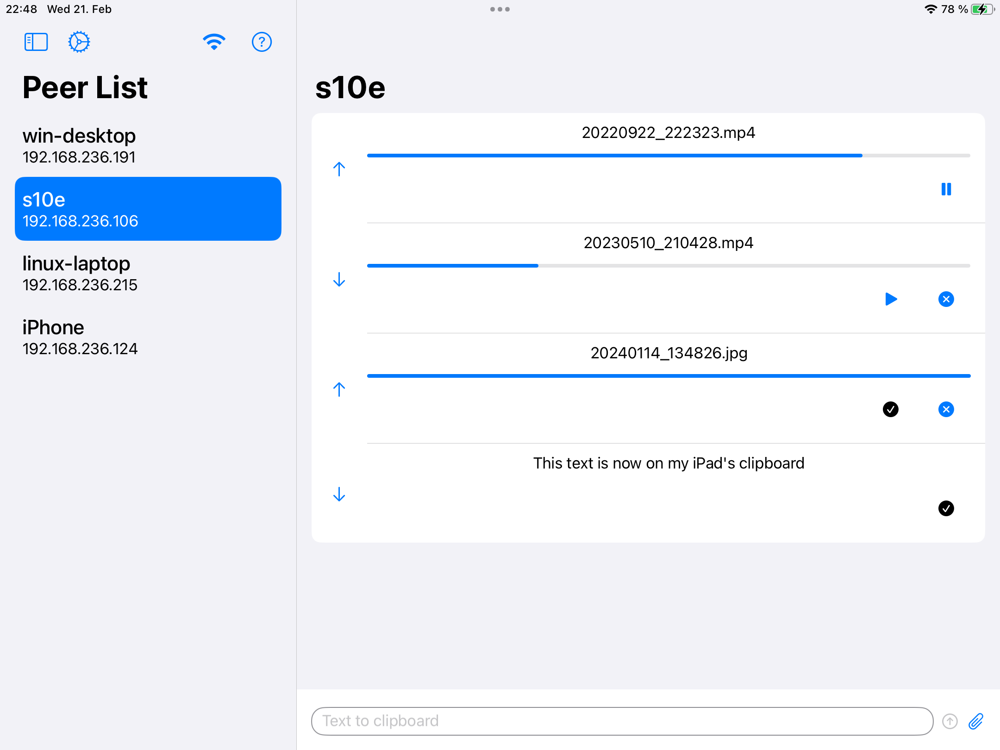
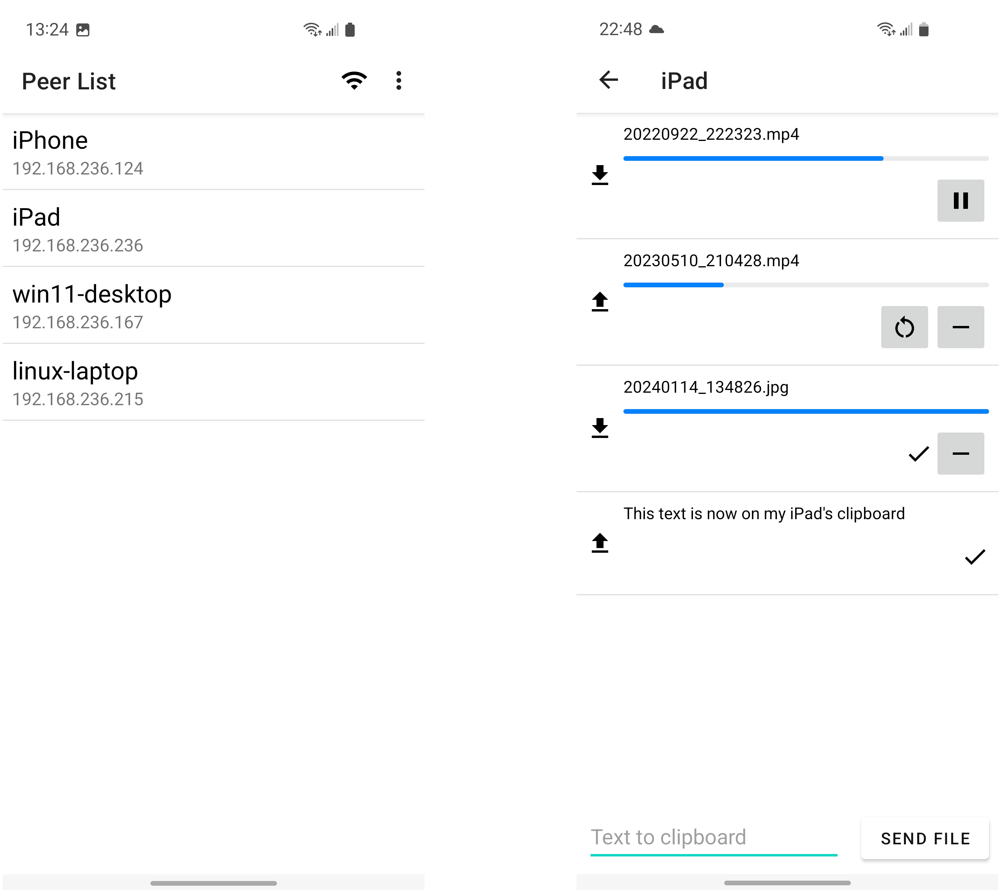
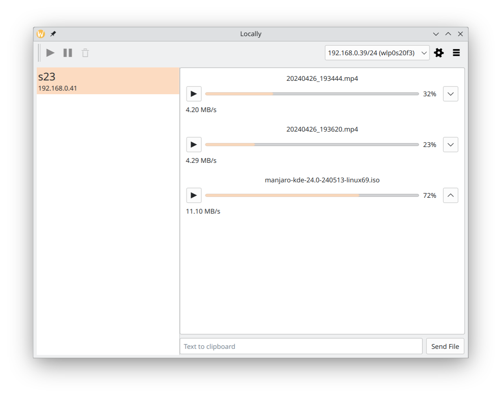

# Locally App

If you ever wished it was easier to send files and text to nearby devices, especially being at home and already connected to the home Wi-Fi, this app might help you. It doesn't require Internet connection and is cross-platform.

Quickly discover devices in your network and send text and files, being able to **continue the sending** if files are too big.

The goal of this project is to achieve frictionless continuity in divergent devices ecosystems.

Stepping stones are remembering devices, being present while in background, joining devices in a group, providing common clipboard and folder.

<p float="left">
    
    
    
</p>

## Downloads

### Android

[Link to Google Play](https://play.google.com/store/apps/details?id=com.trand.locally).

### iOS, macOS, iPadOS

[Link to App Store](https://apps.apple.com/us/app/send-locally/id6475152818).

### Windows 11, 10

* Portable zip: <a href="Locally-Portable-1.5.7-x64.zip">v1.5.7</a>
* Installer <a href="Locally-Installer-1.5.7-x64.exe">v1.5.7</a>

### Linux

* Arch Linux: <a href="archlinux-locally-1.5.7-1-x86_64.pkg.tar.zst">v1.5.7</a>

#### Debian based (*.deb)

* Ubuntu 24.04: <a href="ubuntu_24.04_locally_1.5.7_amd64.deb">v1.5.7</a>
* Ubuntu 23.10: <a href="ubuntu_24.04_locally_1.5.7_amd64.deb">v1.5.7</a>
* Ubuntu 22.04: <a href="ubuntu_22.04_locally_1.5.7_amd64.deb">v1.5.7</a>
* Kubuntu 22.04: <a href="ubuntu_22.04_locally_1.5.7_amd64.deb">v1.5.7</a>
* Ubuntu 20.04: <a href="ubuntu_20.04_locally_1.5.7_amd64.deb">v1.5.7</a>

#### Red Hat based (*.rpm)

* OpenSUSE Tumbleweed: <a href="opensuse-tumbleweed-locally-1.5.7-1.x86_64.rpm">v1.5.7</a>

## June 29, 2024

### Version 1.5.3

* Fix occasionally forgetting user preferences.
* Select downloads directory on Desktop.
* Support macOS 12.

## June 27, 2024

### Version 1.5.2

* Improve stability.
* Remember user choice when removing incoming partial file.
* Fix: on desktop, adjust networks dropdown width when the list changes.
* Fix: don't show ourselves in the peer list.
* Unset downloads directory setting.
* On android, copy button on text messages.

## June 9, 2024

### Version 1.5.1 is available for Desktop, iOS and macOS

* Bug fixes.

## May 28, 2024

### Version 1.4 is available for Desktop

* Improved transfer speed.
* A peer behind firewall can connect, send and receive files from peers outside the firewall without needing to open any ports.
* Show speed and errors on messages.
* Fixed a bug of casual resetting the config saved configuration.

## May 26, 2024

### Version 1.4 is available for Android

Transfer speed is improved, reaching up to 70MB/s when receiving on a mobile device via its own hotspot.
Connectivity is also improved, enabling two devices to communicate seamlessly even when one of them is behind a firewall.

Other changes:
* transfers automatically resume when connection is reestablished or app is restarted, unless there is an error or the transfer is explicitly paused;


## May 22, 2024

### Version 1.4 is available for macOS and iOS

This is the first native version for macOS. Previous versions were available for Silicon Macs as "Designed for iPad" apps. The app is now available for Intel Macs as well.
Transfer speed is improved, reaching up to 70MB/s when receiving on a mobile device via its own hotspot.
Connectivity is also improved, enabling two devices to communicate seamlessly even when one of them is behind a firewall.

Other changes:
* messages include error messages;
* transfers automatically resume when connection is reestablished or app is restarted, unless there is an error or the transfer is explicitly paused;

## What's new in version 1.3 (March 2024)

Apple:
* Share extension. This means you you can go to Photos, select a photo, tap share and select Locally from the list of apps.

Android:
* Pick photos and videos from gallery.

Desktop:
* Change current network.

## What's new in version 1.2 (February 2024)

Apple:
* send from Photos
* select multiple files
* network button on toolbar
* downloads directory setting

Android:
* network button on toolbar
* downloads directory setting
* UI feedback when importing media from cloud

Apple, Android and Desktop:
* bigger font
* improved peer discovery
* some error messages have better explanation

## What's new in version 1.1 (January 2024)

* send text;
* on Android share directly from files or gallery;
* on Desktop drag and drop files to send them.

## Help

On some operating systems you'll need to manually open the port 37789 in order for the app to be discovered and be able to receive files.

### Known operating systems that need manual port opening

1. OpenSUSE Tumbleweed connected to mobile Hotspot network.

    ```
    sudo firewall-cmd --zone=public --add-port=37789/tcp
    sudo firewall-cmd --zone=public --add-port=37789/udp
    ```

    or manually search for _firewall_ in your application menu and open the port 37789.

The app running on a device with restrictive firewall rules will still be able to send files to other devices and discover other devices in the network.

## Contact

<p><a href="mailto:nicktrandafil@gmail.com">Email Nicolai Trandafil</a></p>
