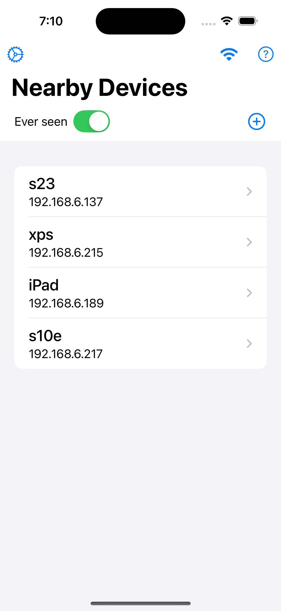
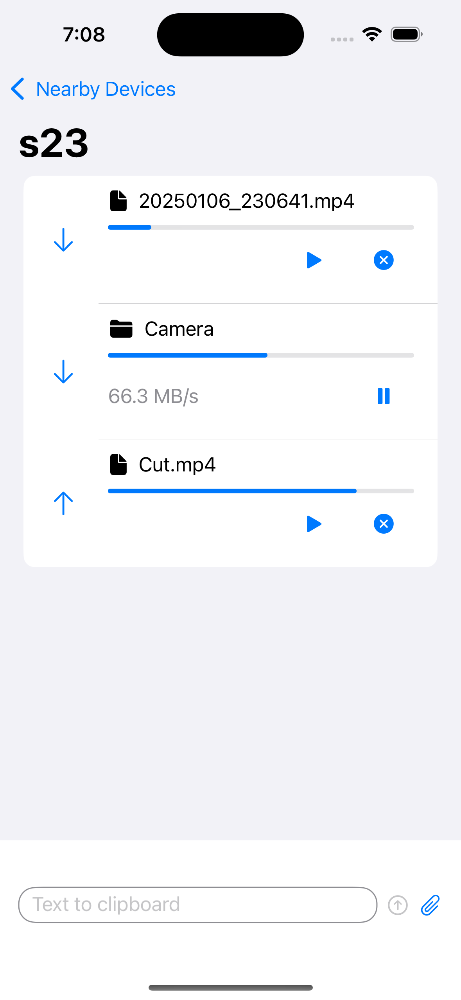
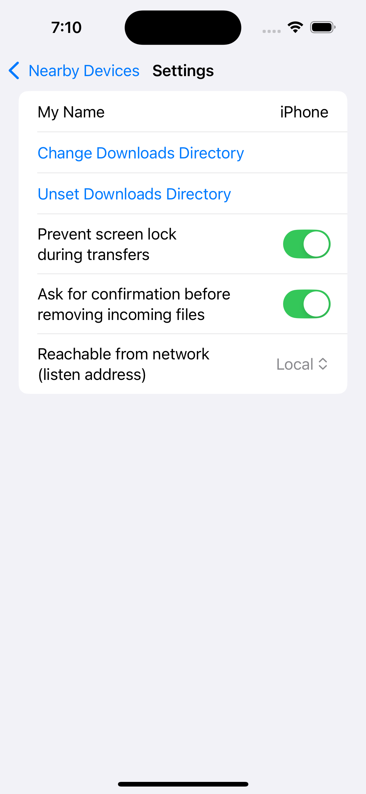
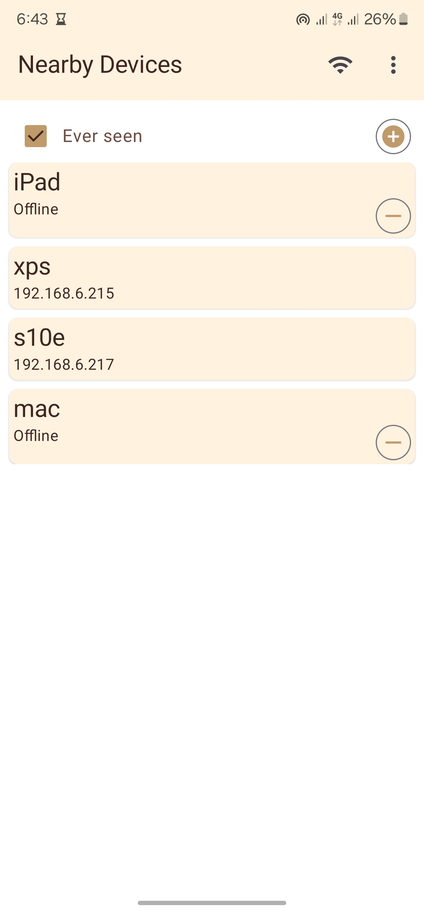
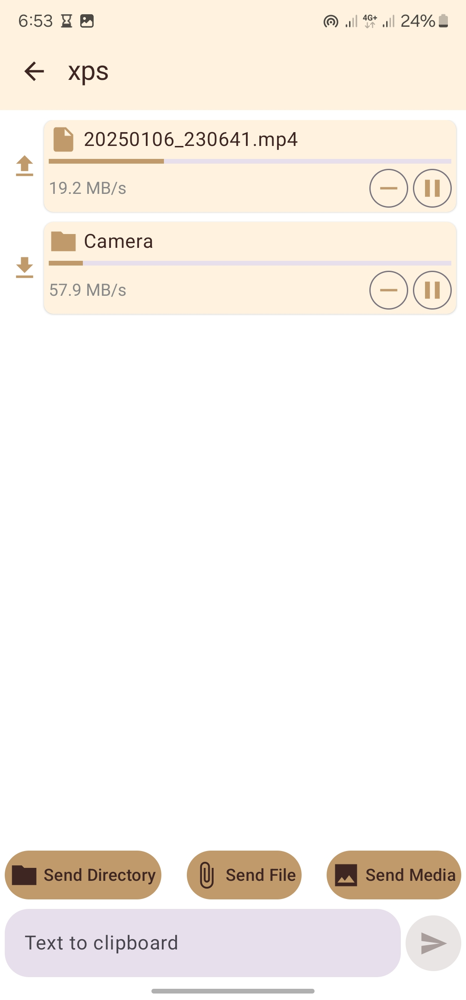
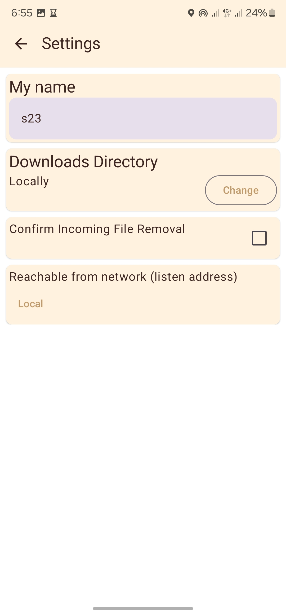
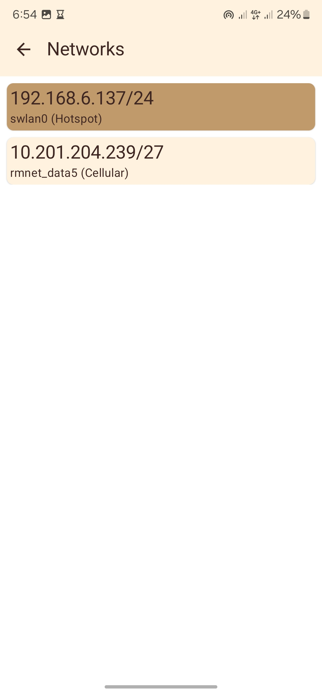
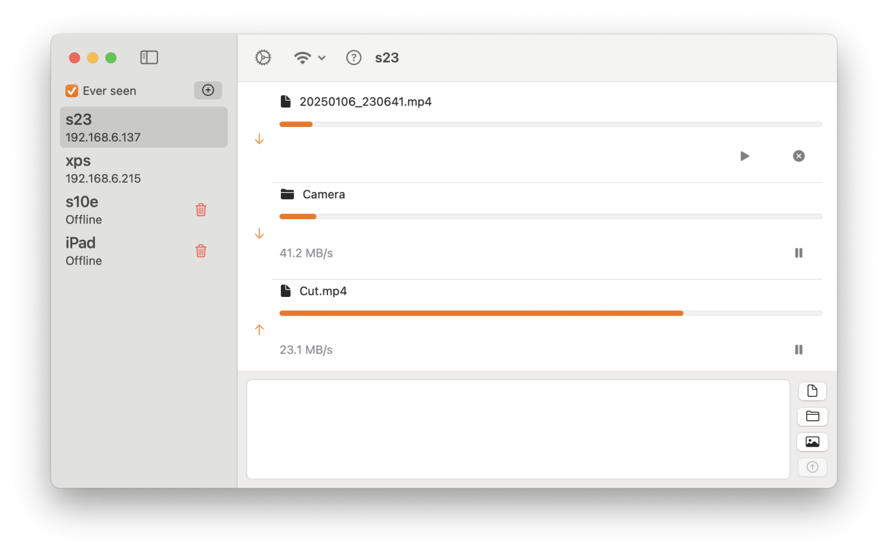
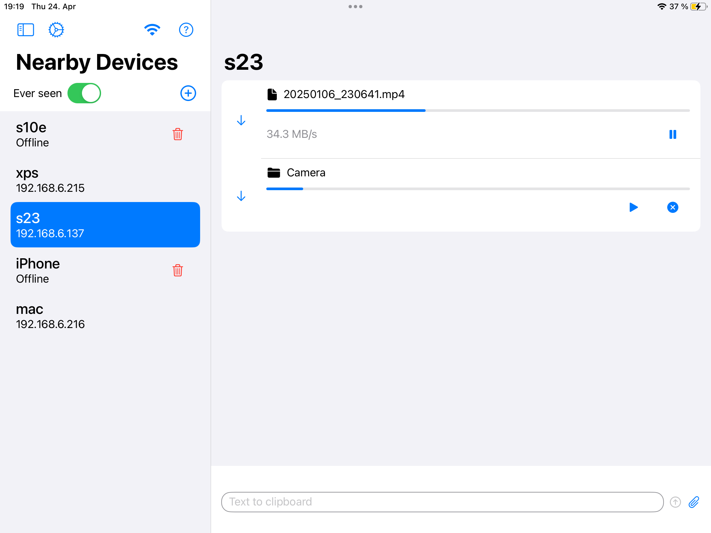
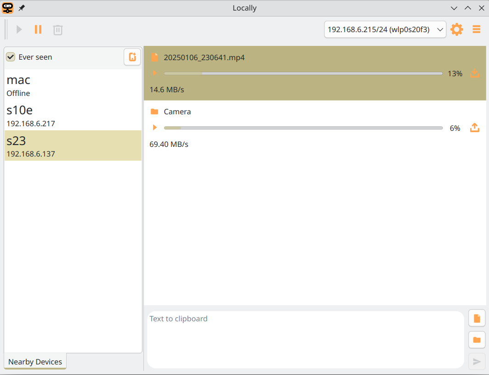

# Locally App

If you ever wished it was easier to send files and text to nearby devices, especially being at home and already connected to the home Wi-Fi, this app might help you. It doesn't require Internet connection and is cross-platform.

Quickly discover devices in your network and send text and files, being able to **continue the sending** if files are too big.

The goal of this project is to achieve frictionless continuity in divergent devices ecosystems.

Stepping stones are remembering devices, being present while in background, joining devices in a group, providing common clipboard and folder.

## Downloads

### Android

[Link to Google Play](https://play.google.com/store/apps/details?id=com.trand.locally).

### iOS, macOS, iPadOS

[Link to App Store](https://apps.apple.com/us/app/send-locally/id6475152818).

### Windows 11, 10

* Portable zip: <a href="Locally-Portable-1.5.12-x64.zip">v1.5.12</a>
* Installer <a href="Locally-Installer-1.5.12-x64.exe">v1.5.12</a>

### Linux

* Arch Linux: <a href="archlinux-locally-1.5.12-1-x86_64.pkg.tar.zst">v1.5.12</a>

#### Debian based (*.deb)

* Ubuntu 24.04: <a href="ubuntu_24.04_locally_1.5.12_amd64.deb">v1.5.12</a>
* Ubuntu 23.10: <a href="ubuntu_24.04_locally_1.5.12_amd64.deb">v1.5.12</a>
* Ubuntu 22.04: <a href="ubuntu_22.04_locally_1.5.12_amd64.deb">v1.5.12</a>
* Kubuntu 22.04: <a href="ubuntu_22.04_locally_1.5.12_amd64.deb">v1.5.12</a>
* Ubuntu 20.04: <a href="ubuntu_20.04_locally_1.5.12_amd64.deb">v1.5.12</a>

#### Red Hat based (*.rpm)

* OpenSUSE Tumbleweed: <a href="opensuse-tumbleweed-locally-1.5.12-1.x86_64.rpm">v1.5.12</a>

## Help

On some operating systems you'll need to manually open the port 37789 in order for the app to be discovered and be able to receive files.

### Known operating systems that need manual port opening

1. OpenSUSE Tumbleweed connected to mobile Hotspot network.

    ```
    sudo firewall-cmd --zone=public --add-port=37789/tcp
    sudo firewall-cmd --zone=public --add-port=37789/udp
    ```

    or manually search for _firewall_ in your application menu and open the port 37789.

The app running on a device with restrictive firewall rules will still be able to send files to other devices and discover other devices in the network.

## Contact

<p><a href="mailto:nicktrandafil@gmail.com">Email Nicolai Trandafil</a></p>

## Gallery

<!-- iOS Screenshots Section -->
<h2 style="text-align: center; font-family: sans-serif;">iOS</h2>
<div style="display: flex; gap: 20px; justify-content: center; flex-wrap: wrap; margin-bottom: 40px;">
  
  
  
</div>

<!-- Android Screenshots Section -->
<h2 style="text-align: center; font-family: sans-serif;">Android</h2>
<div style="display: flex; gap: 20px; justify-content: center; flex-wrap: wrap; margin-bottom: 40px;">
  
  
  
  
</div>

<!-- macOS Screenshot Section -->
<h2 style="text-align: center; font-family: sans-serif;">macOS</h2>
<div style="display: flex; justify-content: center; margin-bottom: 40px;">
  
</div>

<!-- iPad Screenshot Section -->
<h2 style="text-align: center; font-family: sans-serif;">iPad</h2>
<div style="display: flex; justify-content: center; margin-bottom: 40px;">
  
</div>

<!-- Linux Screenshot Section -->
<h2 style="text-align: center; font-family: sans-serif;">Linux</h2>
<div style="display: flex; justify-content: center; margin-bottom: 40px;">
  
</div>
